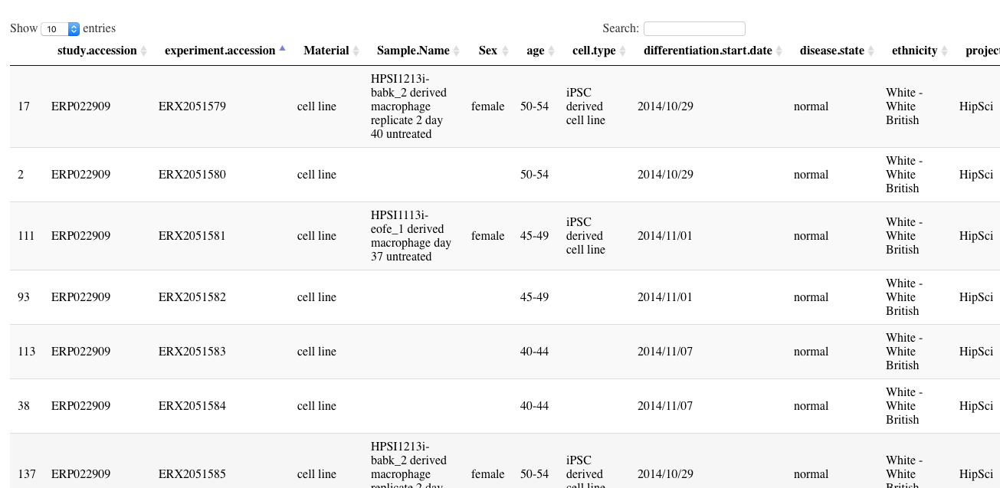
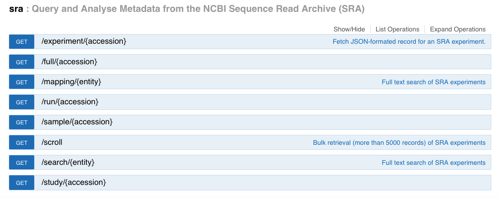

```{r setup,echo=FALSE,results="hide"}
suppressPackageStartupMessages({
suppressMessages({
library(BiocStyle)
library(HumanTranscriptomeCompendium)
library(beeswarm)
library(SummarizedExperiment)
library(DT)
})
})
```

# Introduction

Comprehensive archiving of genome-scale sequencing experiments
is valuable for substantive and methodological progress in
multiple domains.

The `r Biocpkg("HumanTranscriptomeCompendium")` package provides functions for interacting
with quantifications and metadata for over 180000 sequenced human
transcriptomes.

# Access to gene-level quantifications

`r Biocpkg("BiocFileCache")` is used to manage access
to a modest collection of metadata about compendium
contents.  By default, `htx_load` will
load the cache and establish a connection to
remote HDF5 representation of quantifications.
The numerical data is lodged in an instance of
the HDF Scalable Data Service, at `http://hsdshdflab.hdfgroup.org`.

```{r lklo}
library(HumanTranscriptomeCompendium)
genelev = htx_load()
genelev
assay(genelev)
```

## Identifying single-cell RNA-seq studies

We use crude pattern-matching in the study titles
to identify single cell RNA-seq experiments 
```{r lksi}
sing = grep("single.cell", genelev$study_title, 
   ignore.case=TRUE)
length(sing)
```

Now we will determine which studies are involved.
We will check out the titles of the single-cell
studies to assess the specificity of this approach.

```{r chkspec}
sa = genelev$study_accession[sing]
sing2 = sing[-which(duplicated(sa))]
length(sing2)
datatable(as.data.frame(colData(genelev[,sing2])),
   options=list(lengthMenu=c(3,5,10,50,100)))
```

## Collecting bulk RNA-seq samples on a disease of interest: glioblastoma


```{r lkchar}
bulk = genelev[,-sing]
kpglio = grep("glioblastoma", bulk$study_title, 
  ignore.case=TRUE)
glioGene = bulk[,kpglio]
glioGene
```

To acquire numerical values, `as.matrix(assay())` is needed.
```{r lkmat}
beeswarm(as.matrix(assay(
   glioGene["ENSG00000138413.13",1:100])), pwcol=as.numeric(factor(glioGene$study_title[1:100])), ylab="IDH1 expression")
legend(.6, 15000, legend=unique(glioGene$study_accession[1:100]),
   col=1:2, pch=c(1,1))
```

# Access to transcript-level quantifications

By setting `genesOnly` to FALSE in `htx_load`,
we get a transcript-level version of the compendium.
Note that the number of samples in this version exceeds
that of the gene version by two.  There are two
unintended columns in the underlying HDF Cloud
array, with names 'X0' and 'X0.1', that should
be ignored.

```{r dotx}
txlev = htx_load(genesOnly=FALSE)
txlev
```

# Resources of the HumanTranscriptomeCompendium package

The primary purposes of the HumanTranscriptomeCompendium
package are

- providing programmatic acccess to the remote HDF5
representation of the compendium
- providing access to fundamental metadata about the
contents of the compendium
- providing an approach to verifying the correctness
of the representation in the package.

We will address these in turn.

## Access to the quantifications

### `htx_load`

`htx_load` has three arguments: `remotePath`, `cache`, and `genesOnly`.

`genesOnly` defaults to TRUE.  If it is TRUE, the HDF array that
will be used consists of gene-level quantifications; otherwise
the array in use will consist of transcript-level quantifications
based on the Gencode V27 models.

`remotePath` is the path to an RDS-formatted RangedSummarizedExperiment
instance that has been prepared to include a DelayedArray
reference to the HSDS representation of the quantifications.  The
specific reference used depends on the setting of `genesOnly`.
The default value currently references an AWS S3 bucket to 
retrieve the RDS.

`cache` is an instance of `BiocFileCache`, where the RDS
will be stored and retrieved as needed.

A typical use is `htx = htx_load()` which efficiently sets
up `htx` to give access to gene-level quantifications.
After such a command is issued, `assay(htx[G, S])` is the
DelayedMatrix for features `G` on samples `S`.  If `G` or `S`
are too long, the HSDS may return an error.  Systematic
chunking of large requests is a topic of future development.

### `htx_query`

`htx_query` has one mandatory argument,
`study_accessions`.  This function uses `htx_load` to prepare a SummarizedExperiment
with DelayedArray assay data,
with samples limited to those in the studies listed in the character vector
argument `study_accessions`.  Optional arguments to this function
are passed to `htx_load`.

### `htx_app`

`htx_app` has no arguments.  It fires up a shiny app that lists studies by
size, study accession number, and study title.  User can search titles
using regular expressions, and can ask for retrieval of multiple studies.
The studies are returned in a SummarizedExperiment.  This is for use in R.
A more advanced query/retrieval app is prototyped at vjcitn.shinyapps.io/cancer9k.
The cancer9k app provides a 'search engine'-like capability over a richer
collection of sample-level attributes.  See the package at vjcitn/htxapp
for the sources related to cancer9k.

## Fundamental metadata

### bigrnaFiles

This is a vector of length `r length(HumanTranscriptomeCompendium::bigrnaFiles)`.
It provides relative paths for all relevant salmon output files
developed in the BigRNA project.

### experTable, studTable

This is a data.frame with `r nrow(HumanTranscriptomeCompendium::experTable)`
rows and 6 columns.  It is
a record of all SRA experiments for which metadata was retrieved
via SRAdbV2 as of 28 June 2018.  `studTable` provides study title
for each experiment.

### sampleAtts()

This function uses SRAdbV2 in real time to acquire study-level metadata
component 'sample.attributes' for a selected SRA study accession number.

### tx2gene_gencode27()

This function reads `tx2gene.gencode.v27.csv` from `r Biocpkg("tximportData")`.

### `uniqueAcc_120518`

A character vector of 186011 unique experiment accession numbers.

### HumanTranscriptomeCompendium.colnames

A vector of 181136 strings giving the column names for the
transcript-level quantifications.

### addRD()

This utility will add a rowData component to the result of
`htx_load(, ..., genesOnly=TRUE )` giving the gene type, gene id,
gene name, and havana gene for each row as available.

## Verification tools

The production of HumanTranscriptomeCompendium has considerable
complexity.  There is a persistent repository of salmon outputs at
```
http://bigrna.cancerdatasci.org/results/human/27/*
   /aux_info/meta_info.json
```
where experiment accession is substitute for *.  `procExpToGene` takes
an experiment accession number and materializes the salmon quantification
for the user in the form

```
>      str(nn)
List of 4
 $ abundance          : num [1:58288, 1] 22.8668 0.0286 32.8925 2.9392 4.1314 ...
  ..- attr(*, "dimnames")=List of 2
  .. ..$ : chr [1:58288] "ENSG00000000003.14" "ENSG00000000005.5" "ENSG00000000419.12" "ENSG00000000457.13" ...
  .. ..$ : NULL
 $ counts             : num [1:58288, 1] 2427 2 1744 634 662 ...
  ..- attr(*, "dimnames")=List of 2
  .. ..$ : chr [1:58288] "ENSG00000000003.14" "ENSG00000000005.5" "ENSG00000000419.12" "ENSG00000000457.13" ...
  .. ..$ : NULL
 $ length             : num [1:58288, 1] 1962 1294 980 3984 2964 ...
  ..- attr(*, "dimnames")=List of 2
  .. ..$ : chr [1:58288] "ENSG00000000003.14" "ENSG00000000005.5" "ENSG00000000419.12" "ENSG00000000457.13" ...
  .. ..$ : NULL
 $ countsFromAbundance: chr "lengthScaledTPM"
```

This can be used to check the accuracy of the image of the data in HSDS.

# Comments on motivation

Our main concern is to provide a unified and reasonable efficient
access to uniformly preprocessed SRA RNA-seq studies.
The quantifications are provided at
an instance of the HDF Scalable Data Service.  The `Biocpkg("restfulSE")`
and `Biocpkg("rhdf5client")` packages allow interrogation of the
service via familiar SummarizedExperiment-based programming.

The quantifications are not all that useful in the absence of
accurate metadata (although large-scale unsupervised learning processes
are certainly feasible without such metadata).  We have therefore
put a lot of effort into streamlining the acquisition and binding
of sample-level metadata.

The following is a sketch of the metadata model for SRA contributions.


"sample.attributes" can have much more (or less) information than is depicted.  In
fact, for some studies, a sparse setup seems to be used.



We want to make it very easy to use the swagger API set up
by Sean Davis for SRA metadata.




However, real-time querying may be tedious and/or fragile.  Therefore
we have taken snapshots of the sample.attributes components for all
studies, serialized them to csv, indexed them using the csv2envs
utility of htxapp, and produced hashed environments to support
interactive search using the selectize.js functionality.  These
details are worked out in vjcitn/htxapp.
